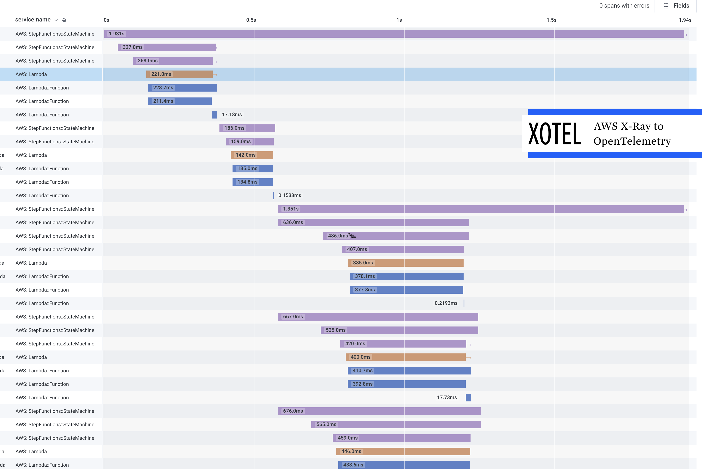

# XOTEL - Xray to OTEL

Export traces from AWS Xray and forward them to an OTEL Collector.



### Testers wanted

> This project is under rapid development.

If you can help jump into the issue queue.

If you have bugs running this, please file an issue. I'm keen to get this to
a production capable state before August 2022.

Can you help identify if the fields are mapped correctly?

Does the data coming through to your OTEL system look the way you expected?

## Getting Started

Set `OTEL_EXPORTER_OTLP_ENDPOINT` to a GRPC OTLP collector, for example `localhost:4317` if running a collector on the same machine.

Run this with IAM credentials that has access to:

```
xray:GetTraceSummaries
xray:BatchGetTraces
```

Either by deploying to EC2/ECS with an attached role or setting the following environment variables.

```
AWS_ACCESS_KEY_ID
AWS_SECRET_ACCESS_KEY
AWS_SESSION_TOKEN
```

## Deploy with Cloudformation

You can use the example [cfn-templates/Xotel.yaml](cfn-templates/Xotel.yaml)
template to deploy XOTEL.

Follow the comments in the template for the configuration you need to set, in
particular where you want to send the X-Ray traces.

### Container Image

Availble on docker hub at [ojkelly/xotel](https://hub.docker.com/repository/registry-1.docker.io/ojkelly/xotel/tags?page=1&ordering=last_updated).

### Configuration

Currently this takes configuration for the min and max time to look back when,
querying Xray for traces.

#### LOOKBACK

The max look back time is also the interval between checks.

For example with the following settings xotel will query T-90s to T-30s, and
it will run that query every minute.

A minimum lookback time can be tuned to allow time for all trace data to arrive
at Xray and be processed.

```
XOTEL_MAX_LOOK_BACK="1m"
XOTEL_MIN_LOOK_BACK="30s"
```

By default these are set to `6m` and `1m`.

**The value of `XOTEL_MAX_LOOK_BACK` is also the lag for getting new traces from
Xray to your OTEL system.**

### Limitations

A current limitation is that it only works with a GRPC collector, set with the `OTEL_EXPORTER_OTLP_ENDPOINT` env var.

The code for that is here [exporter/exporter.go](exporter/exporter.go), if you
can help expand this to fully support what a normal collector would, a PR or
guidance is appreciated.

## How to deploy

> Coming soon.
